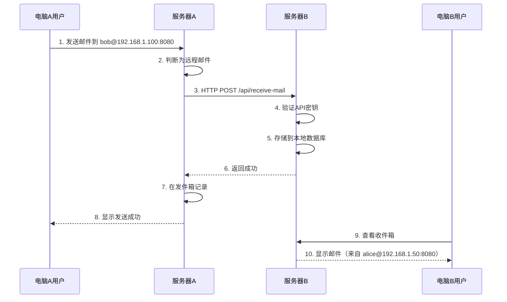

# 邮件系统远程传输功能 - 实现说明

## 功能概述

本次更新为邮件系统添加了**跨服务器远程邮件传输**功能，支持在两台不同电脑之间发送和接收邮件。

### 核心特性

- 📤 **远程发送**：用户可以向另一台服务器上的用户发送邮件
- 📥 **远程接收**：提供API端点接收来自其他服务器的邮件
- 📎 **附件支持**：远程邮件支持附件传输（Base64编码）
- 🔒 **安全验证**：API密钥 + 时间戳 + 签名验证

---

## 邮箱地址格式

| 类型 | 格式 | 示例 |
|------|------|------|
| 本地用户 | `username@localhost` 或 `邮箱地址` | `alice@localhost`、`alice@mail.com` |
| 远程用户 | `username@IP:端口` | `bob@192.168.1.100:8080` |

---

## 文件变更清单

### 新增文件（4个）

| 文件路径 | 说明 |
|----------|------|
| [RemoteMailConfig.java](file:///c:/Users/wudon/Desktop/mail_last/src/main/java/com/mail/util/RemoteMailConfig.java) | 远程服务器配置工具类 |
| [RemoteMailDTO.java](file:///c:/Users/wudon/Desktop/mail_last/src/main/java/com/mail/dto/RemoteMailDTO.java) | 远程邮件数据传输对象 |
| [RemoteMailService.java](file:///c:/Users/wudon/Desktop/mail_last/src/main/java/com/mail/service/RemoteMailService.java) | 远程邮件发送服务 |
| [ReceiveMailApiServlet.java](file:///c:/Users/wudon/Desktop/mail_last/src/main/java/com/mail/servlet/api/ReceiveMailApiServlet.java) | 远程邮件接收API |

### 修改文件（4个）

| 文件路径 | 修改内容 |
|----------|----------|
| [Mail.java](file:///c:/Users/wudon/Desktop/mail_last/src/main/java/com/mail/model/Mail.java) | 添加远程邮件字段 |
| [ComposeServlet.java](file:///c:/Users/wudon/Desktop/mail_last/src/main/java/com/mail/servlet/ComposeServlet.java) | 集成远程发送逻辑 |
| [InboxServlet.java](file:///c:/Users/wudon/Desktop/mail_last/src/main/java/com/mail/servlet/InboxServlet.java) | 支持显示远程发件人 |
| [SentServlet.java](file:///c:/Users/wudon/Desktop/mail_last/src/main/java/com/mail/servlet/SentServlet.java) | 支持显示远程收件人 |

---

## 数据库更新

> [!IMPORTANT]
> **必须执行以下SQL语句**来更新数据库表结构：

```sql
-- 在mails表中添加远程邮件相关字段
ALTER TABLE mails ADD COLUMN is_remote TINYINT(1) DEFAULT 0 COMMENT '是否为远程邮件 0=本地 1=远程';
ALTER TABLE mails ADD COLUMN sender_server VARCHAR(255) DEFAULT NULL COMMENT '发送方服务器地址（远程邮件）';
ALTER TABLE mails ADD COLUMN remote_sender_email VARCHAR(255) DEFAULT NULL COMMENT '远程发送方/收件方完整邮箱地址';
```

---

## 部署配置流程

### 第1步：更新数据库

在**两台电脑**的MySQL数据库中执行上述SQL语句。

### 第2步：配置服务器地址

编辑 `RemoteMailConfig.java`，修改以下配置：

```java
// 修改为本机的实际IP地址（不是localhost）
private static String LOCAL_SERVER_HOST = "192.168.1.50";  // 改为实际IP

// 修改为Tomcat端口（默认8080）
private static int LOCAL_SERVER_PORT = 8080;

// 修改为应用上下文路径
private static String CONTEXT_PATH = "/mail-system";

// 【重要】设置相同的API密钥（两台服务器必须一致）
private static String API_SECRET_KEY = "你的复杂密钥字符串";
```

> [!CAUTION]
> **两台服务器必须配置相同的 `API_SECRET_KEY`**，否则无法互相发送邮件！

### 第3步：部署应用

1. 重新编译项目：`mvn clean package`
2. 将生成的 `mail-system.war` 部署到Tomcat
3. 确保两台电脑之间网络可达（能相互ping通）
4. 确保防火墙允许Tomcat端口（默认8080）

### 第4步：验证API端点

在浏览器访问：`http://服务器IP:8080/mail-system/api/receive-mail`

应该看到JSON响应：
```json
{"success":true,"message":"邮件接收API正常运行"}
```

---

## 使用方法

### 发送远程邮件

1. 登录系统，点击"写邮件"
2. 在收件人输入框填写：`用户名@服务器IP:端口`
   - 例如：`bob@192.168.1.100:8080`
3. 填写主题和正文，添加附件（可选）
4. 点击发送

### 接收远程邮件

无需特殊操作。当其他服务器发送邮件时，会自动出现在收件箱中。

远程邮件会显示完整的发送方地址，例如：`alice@192.168.1.50:8080`

---

## 测试场景

| 测试内容 | 预期结果 |
|----------|----------|
| 电脑A向电脑B发送文字邮件 | B的收件箱显示邮件，A的发件箱记录发送 |
| 电脑A向电脑B发送带附件邮件 | B收到邮件和附件 |
| 电脑B回复电脑A的邮件 | A的收件箱收到回复 |
| 发送到不存在的远程用户 | 显示"接收方用户不存在"错误 |
| 远程服务器离线时发送 | 显示"无法连接到远程服务器"错误 |

---

## 架构示意图



---

## 常见问题

### Q: 发送时提示"无法连接到远程服务器"

检查：
1. 目标服务器是否启动
2. 网络是否可达（ping测试）
3. 防火墙是否阻止8080端口
4. 收件人地址格式是否正确

### Q: 发送时提示"API密钥无效"

两台服务器的 `RemoteMailConfig.java` 中 `API_SECRET_KEY` 必须完全相同。

### Q: 收件箱没有显示远程邮件

检查数据库是否已执行ALTER TABLE语句添加新字段。
